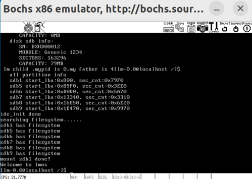

# 小型操作系统 LMOS
  - 从0到1实现操作系统，LMOS是一个 基于x86的 OS，使用  c 语言加一些必要的汇编代码编写。参考学习了[《操作系统真象还原》](https://yifengyou.gitbooks.io/os-elephant/content/)、[《一个64位操作系统的设计与实现》](https://yifengyou.gitbooks.io/the-design-and-implementation-of-a-64-bit-os/content/)、[《Linux-0.11完全注释》](https://gitee.com/shen-lifeng/linux-0.11-note)[操作系统李治军老师](https://www.bilibili.com/video/BV1iW411Y73K/?spm_id_from=333.1007.top_right_bar_window_custom_collection.content.click&vd_source=01f96b5bbe5991879bf62bc9b27d0303)等。
  
- os by rust
  > [rcore](https://rcore-os.cn/rCore-Tutorial-Book-v3/index.html)、
  > [Writing an os in rust](https://os.phil-opp.com/)
  
-  此项目是为了进一步学习操作系统、探索操作系统内核的秘密。_欢迎大家贡献自己的 idea. 非常期待与您一起探索神秘的内核。
  
## 已实现的模块功能
- 引导程序
- 内存分页 + 虚拟内存
- 多进程/线程的调度
- 中断系统
- 外设 键盘、显示器
- 内存管理
- 类unix的文件系统
- shell，以及一些shell命令

## 待探索模块
- Gui
- 网络编程
- 外部程序的编译、执行
- 类似 vim 的万能编辑功能等

## 系统演示

## How to build
[**环境配置**](https://zhuanlan.zhihu.com/p/477175642)

下载：` git clone https://github.com/lmve/LMOS.git `

编译：` make all `

运行：` bin/bochs -f bouchsrc.disk `

